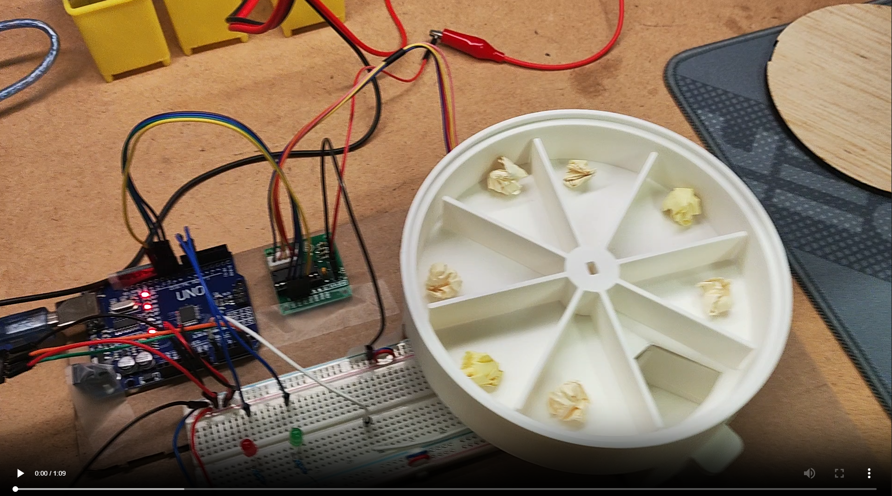

# Pill-O-Matic: Real-Time Scheduled Automatic Pill Dispenser

- Arduino-based automatic pill dispenser with sensor-driven safety logic and stepper-controlled mechanical dispensing.

## Documentation

- [System Design and Implementation](Pill-O-Matic_System_Design_and_Implementation.md) 
- [Project Summary](Pill-O-Matic_Project_Summary.md) 

## Demonstration

## Project Overview

Pill-O-Matic is a real-time scheduled automatic pill dispenser designed to deliver single doses of medication at predefined times throughout the day. The system integrates sensing, timing, control logic, and mechanical actuation to ensure reliable and user-aware dispensing.

An Arduino Uno coordinates the system using a DS3231 real-time clock (RTC) module for accurate scheduling. At each scheduled time, the system verifies tray presence using an analog Hall effect sensor before actuating a stepper motor to rotate a compartmentalized pill wheel and dispense one dose. The system prevents incorrect operation through state-based logic, ensuring pills are only dispensed when appropriate conditions are met.

## Technical Highlights

- **Full-stack application development**: Designed and built a complete application with user-facing workflows, persistent data, and practical end-to-end functionality.
- **User interface design**: Created an intuitive interface focused on clarity, accessibility, and ease of use for managing medication-related tasks.
- **State and data management**: Structured application data for tracking pills, schedules, user inputs, and related records.
- **Problem-solving with real-world constraints**: Built around a practical healthcare-adjacent use case where accuracy, reminders, and usability matter.
- **Software architecture**: Organized the project into maintainable components with clear responsibilities.
- **Debugging and testing**: Identified issues through hands-on testing and improved reliability through iterative fixes.
- **Git and GitHub workflow**: Used version control to manage project history and collaborate through a standard repository workflow.
- **Technical communication**: Presented project functionality, design decisions, and implementation details for both technical and non-technical readers.

## Key Features

- Real-time scheduled dispensing using RTC-based timing  
- Sensor-based tray detection using analog Hall effect sensor (SS49E)  
- Stepper motor-driven mechanical indexing (45° per dose)  
- State-based control logic to prevent missed or duplicate dispensing  
- User interaction detection via tray removal (no buttons required)  
- Energy-efficient motor control with zero idle current draw  

## System Architecture

- **Controller:** Arduino Uno  
- **Timing Module:** DS3231 Real-Time Clock (RTC)  
- **Sensor:** SS49E Analog Hall Effect Sensor  
- **Actuator:** 28BYJ-48 5V Stepper Motor + ULN2003 Driver  
- **User Feedback:** Red and Green LEDs  
- **Power:** External 5V supply for motor (shared ground with Arduino)  

## System Operation

1. The RTC continuously tracks real time  
2. The Arduino checks scheduled dispensing times  
3. The Hall sensor verifies tray presence  
4. If conditions are met, the stepper motor rotates 45° to dispense one dose  
5. The system waits for tray removal before allowing the next dispense  
6. If the tray is missing or a pill is still present, dispensing is blocked  

## Fabrication and Materials

- 3D-printed PLA pill wheel and tray for precise geometry  
- Plywood lid for enclosure support and accessibility  
- Solderless breadboard for circuit prototyping  
- Embedded magnets for tray detection  

## Key Design Decisions

- Selected Hall effect sensing over force-based detection due to low pill weight, improving reliability  
- Implemented state-based logic to handle missed doses and prevent unsafe operation  
- Disabled stepper motor holding current to reduce power consumption and prevent overheating  
- Designed mechanical clearances to ensure smooth motion without post-processing  
- Used a hybrid material approach (PLA + plywood) to balance precision and structural simplicity  

## Future Improvements

- Improve enclosure robustness and overall durability  
- Integrate user interface (LCD display or alert system)  
- Add battery power for standalone operation  
- Enable wireless connectivity for remote monitoring and notifications  
- Expand system with data logging and health tracking features  

## Outcome

This project demonstrates the successful design and integration of an electromechanical system combining hardware, firmware, and mechanical components. The final prototype reliably performs time-based dispensing with sensor-driven safety logic and efficient power management, showcasing practical engineering problem-solving and system-level thinking.
